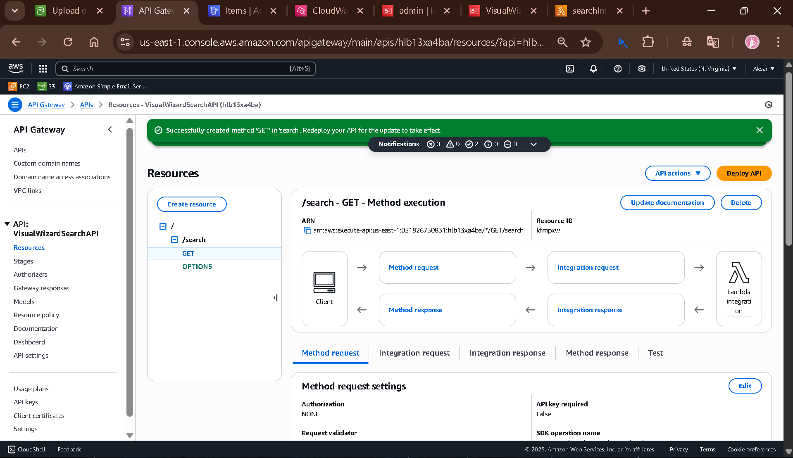
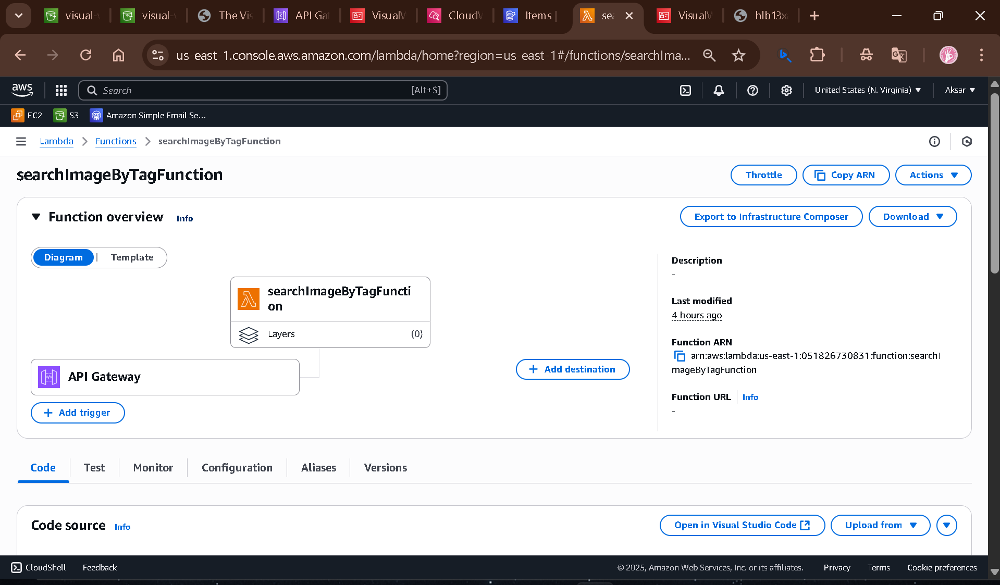
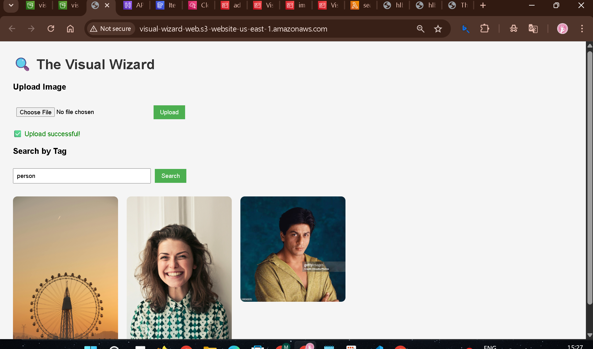

# 🧙‍♂️ The Visual Wizard

Automatically tag and search images using AWS Rekognition, Lambda, API Gateway, and DynamoDB — all accessible via a web frontend.

---

## 📌 Table of Contents

- [Project Overview](#project-overview)
- [Architecture Diagram](#architecture-diagram)
- [Real-World Use Cases](#real-world-use-cases)
- [Phase-wise Implementation Plan](#phase-wise-implementation-plan)
- [Complete Step-by-Step Setup Guide](#complete-step-by-step-setup-guide)
- [IAM Policies](#iam-policies)
- [Frontend Code](#frontend-code)
- [Screenshots](#screenshots)
- [Final Thoughts](#final-thoughts)

---

## 🚀 Project Overview

**The Visual Wizard** is an intelligent image processing pipeline that allows users to:

- Upload images to S3 via a simple web interface
- Automatically analyze images using AWS Rekognition
- Store identified labels and image metadata in DynamoDB
- Search images based on tags via API Gateway
- View the matched images directly on the same web interface

**AWS Services Used:**

- S3 (Image Storage + Web Hosting)
- Lambda (Image Processing + API Handling)
- Rekognition (Auto-tagging of Images)
- DynamoDB (Metadata Storage)
- API Gateway (Tag Search API)
- CloudWatch (Logs + Debugging)

---

## 🧱 Architecture Diagram

>

---

## 🌍 Real-World Use Cases

- **E-Commerce**: Automatically categorize product images for easier inventory management.
- **Medical Imaging**: Auto-label and search through X-rays, MRI scans, etc.
- **Security & Surveillance**: Tag and search security camera footage to identify people, objects, or scenes.
- **Photo Management Apps**: Create smart photo search by themes or objects.

---

## 📋 Phase-wise Implementation Plan

| Phase | Task                                        | Tools/Services       |
| ----- | ------------------------------------------- | -------------------- |
| 1️⃣   | Set up S3 to upload images                  | S3                   |
| 2️⃣   | Trigger Lambda when image is uploaded       | Lambda               |
| 3️⃣   | Auto-label image using Rekognition          | Rekognition          |
| 4️⃣   | Store labels + image info                   | DynamoDB             |
| 5️⃣   | Create API to search images by tags         | API Gateway + Lambda |
| 6️⃣   | Build web page to upload/search/view images | HTML + JS            |
| 7️⃣   | Host the webpage for free                   | S3 Static Hosting    |

---

## 🛠️ Complete Step-by-Step Setup Guide

### 📁 Phase 1: Upload Images to S3

1. Create a bucket named `visual-wizard-photos`
2. Inside it, create a folder named `images/`
3. 
4. Set the bucket policy for public upload and read access:

```json
{
  "Version": "2012-10-17",
  "Statement": [
    {
      "Sid": "PublicUpload",
      "Effect": "Allow",
      "Principal": "*",
      "Action": ["s3:PutObject"],
      "Resource": "arn:aws:s3:::visual-wizard-photos/images/*"
    },
    {
      "Sid": "PublicReadGetObject",
      "Effect": "Allow",
      "Principal": "*",
      "Action": ["s3:GetObject"],
      "Resource": "arn:aws:s3:::visual-wizard-photos/images/*"
    }
  ]
}
```

### ⚙️ Phase 2: Create Lambda Function for Image Labeling

1. Name: `VisualWizardProcessor`
2. Trigger: S3 PUT on `visual-wizard-photos/images/`
3. 
4. Add the following IAM Policy:

```json
{
  "Version": "2012-10-17",
  "Statement": [
    {
      "Effect": "Allow",
      "Action": [
        "rekognition:DetectLabels",
        "s3:GetObject",
        "dynamodb:PutItem",
        "logs:CreateLogGroup",
        "logs:CreateLogStream",
        "logs:PutLogEvents"
      ],
      "Resource": "*"
    }
  ]
}
```
5. Deploy Lambda function Python code :

```python
import boto3
import json

rekognition = boto3.client('rekognition')
dynamodb = boto3.client('dynamodb')

def lambda_handler(event, context):
    try:
        record = event['Records'][0]
        bucket = record['s3']['bucket']['name']
        image_key = record['s3']['object']['key']

        response = rekognition.detect_labels(
            Image={'S3Object': {'Bucket': bucket, 'Name': image_key}},
            MaxLabels=10,
            MinConfidence=75
        )

        labels = [label['Name'] for label in response['Labels']]

        dynamodb.put_item(
            TableName='imagetable',
            Item={
                'ImageKey': {'S': image_key},
                'Bucket': {'S': bucket},
                'Labels': {'L': [{'S': label} for label in labels]}
            }
        )

        return {
            'statusCode': 200,
            'body': json.dumps('Success: Image processed and tags stored.')
        }

    except Exception as e:
        return {
            'statusCode': 500,
            'body': json.dumps(f'Error: {str(e)}')
        }
```
 
5. Store the labels and metadata in DynamoDB table `imagetable`
   - Partition Key: `ImageKey` (string)
   

### 🔍 Phase 3–4: Setup Rekognition and DynamoDB

- No extra setup for Rekognition (built-in AWS)
- Create DynamoDB Table: `imagetable`
  - Partition key: `ImageKey`
  - Store labels as string list and metadata (e.g., timestamp)
  - 

### 🌐 Phase 5: API Gateway + Search Lambda

1. Create Lambda: `SearchImageByTagFunction`
2. 
3. Add IAM Policy:

```json
{
    "Version": "2012-10-17",
    "Statement": [
        {
            "Effect": "Allow",
            "Action": [
                "dynamodb:Scan",
                "dynamodb:GetItem",
                "dynamodb:Query"
            ],
            "Resource": "arn:aws:dynamodb:us-east-1:*:table/imagetable"
        },
        {
            "Effect": "Allow",
            "Action": [
                "logs:*"
            ],
            "Resource": "*"
        }
    ]

```
4. Deploy Lambda function Python code :
```python
import json
import boto3

dynamodb = boto3.resource('dynamodb')
table = dynamodb.Table('imagetable')

def lambda_handler(event, context):
    print("Received event:", json.dumps(event))
    
    # ✅ Fix for tag reading
    tag = event.get('tag')
    
    if not tag:
        return {
            "statusCode": 400,
            "body": json.dumps({"error": "Missing tag parameter in query string"})
        }
    
    response = table.scan()
    matching_items = []
    for item in response['Items']:
        labels = item.get('Labels', [])
        if tag.lower() in [label.lower() for label in labels]:
            matching_items.append(item)
    
    return {
        "statusCode": 200,
        "body": json.dumps(matching_items)
    }
 ```


6. Create a GET method with query string param `tag` using API Gateway
7. 
8. Integrate this API with `SearchImageByTagFunction` Lambda
9. 

### 🧑‍💻 Phase 6–7: Frontend + Static Hosting

1. Create a new S3 bucket: `visual-wizard-web`
2. 
3. Upload `index.html` file
4. 
5. Enable static hosting
6. CORS config for `visual-wizard-photos`:

```json
[
  {
        "AllowedHeaders": [
            "*"
        ],
        "AllowedMethods": [
            "GET",
            "PUT",
            "POST"
        ],
        "AllowedOrigins": [
            "*"
        ],
        "ExposeHeaders": [
            "ETag"
        ],
        "MaxAgeSeconds": 3000
    }

]
```
 

---

## 🧑‍💻 Frontend Code (index.html)

```html
<!DOCTYPE html>
<html>
<head>
  <meta charset="UTF-8" />
  <title>The Visual Wizard</title>
  <style>
    body {
      font-family: Arial, sans-serif;
      margin: 30px;
      background-color: #f5f5f5;
    }
    h1 {
      color: #333;
    }
    input[type="file"], input[type="text"] {
      margin: 10px 0;
      padding: 8px;
      width: 300px;
    }
    button {
      padding: 8px 15px;
      margin-left: 5px;
      background-color: #4CAF50;
      color: white;
      border: none;
      cursor: pointer;
    }
    button:hover {
      background-color: #45a049;
    }
    .image-grid {
      margin-top: 20px;
      display: grid;
      grid-template-columns: repeat(auto-fill, minmax(200px, 1fr));
      gap: 20px;
    }
    .image-item img {
      width: 100%;
      height: auto;
      border-radius: 10px;
    }
    .error {
      color: red;
      margin-top: 10px;
    }
    .success {
      color: green;
      margin-top: 10px;
    }
  </style>
</head>
<body>

  <h1>🔍 The Visual Wizard</h1>

  <h3>Upload Image</h3>
  <input type="file" id="imageInput" />
  <button onclick="uploadImage()">Upload</button>
  <div id="uploadStatus" class="error"></div>

  <h3>Search by Tag</h3>
  <input type="text" id="searchTag" placeholder="e.g., Dog, Car, Tree" />
  <button onclick="searchImages()">Search</button>

  <div class="image-grid" id="results"></div>

  <script>
    const s3BucketName = "visual-wizard-photos";
    const s3Folder = "images/";
    const apiUrl = "https://hlb13xa4ba.execute-api.us-east-1.amazonaws.com/prod/search"; // ✅ Replace with your API Gateway URL

    async function uploadImage() {
      const fileInput = document.getElementById("imageInput");
      const statusDiv = document.getElementById("uploadStatus");
      statusDiv.textContent = "";
      statusDiv.className = "";

      if (!fileInput.files.length) {
        statusDiv.textContent = "Please select an image to upload.";
        statusDiv.className = "error";
        return;
      }

      const file = fileInput.files[0];
      const fileName = encodeURIComponent(file.name);
      const uploadUrl = `https://${s3BucketName}.s3.amazonaws.com/${s3Folder}${fileName}`;

      try {
        const response = await fetch(uploadUrl, {
          method: "PUT",
          headers: {
            "Content-Type": file.type
          },
          body: file
        });

        if (response.ok) {
          statusDiv.textContent = "✅ Upload successful!";
          statusDiv.className = "success";
          fileInput.value = "";
        } else {
          throw new Error(`Upload failed with status: ${response.status}`);
        }
      } catch (error) {
        statusDiv.textContent = `❌ Upload failed: ${error.message}`;
        statusDiv.className = "error";
      }
    }

    async function searchImages() {
      const tag = document.getElementById("searchTag").value.trim();
      const resultsDiv = document.getElementById("results");
      resultsDiv.innerHTML = "";

      if (!tag) {
        alert("Please enter a tag to search.");
        return;
      }

      try {
        const response = await fetch(`${apiUrl}?tag=${encodeURIComponent(tag)}`);
        const data = await response.json();

        const images = JSON.parse(data.body);
        if (images.length === 0) {
          resultsDiv.innerHTML = "<p>No images found.</p>";
          return;
        }

        images.forEach(item => {
          const imageUrl = `https://${item.Bucket}.s3.amazonaws.com/${item.ImageKey}`;
          const imageDiv = document.createElement("div");
          imageDiv.className = "image-item";
          imageDiv.innerHTML = ``;
          resultsDiv.appendChild(imageDiv);
        });

      } catch (err) {
        resultsDiv.innerHTML = `<div class="error">❌ Error fetching images: ${err.message}</div>`;
      }
    }
  </script>
</body>
</html>
```

---

## Challengs I Faces

| Challenge                          | Solution                                                              |
| ---------------------------------- | --------------------------------------------------------------------- |
| CORS Errors on API Gateway         | Added CORS headers (Allow-Origin, Allow-Methods) manually in Lambda   |
| Upload Failures due to Permissions | Added `s3:PutObject` policy for public uploads in S3                  |
| Images not loading in search       | Applied `s3:GetObject` permission and public read policy to S3 bucket |
| JSON-only CORS config in S3        | Used correct JSON format in CORS section of S3                        |


## ✅ Final Thoughts

This project demonstrates how to use AWS services to build a powerful and searchable image tagging application. It covered:

- Uploading to S3
- Image recognition using Rekognition
- Tag storage in DynamoDB
- RESTful search via API Gateway + Lambda
- Web frontend hosted on S3


---


