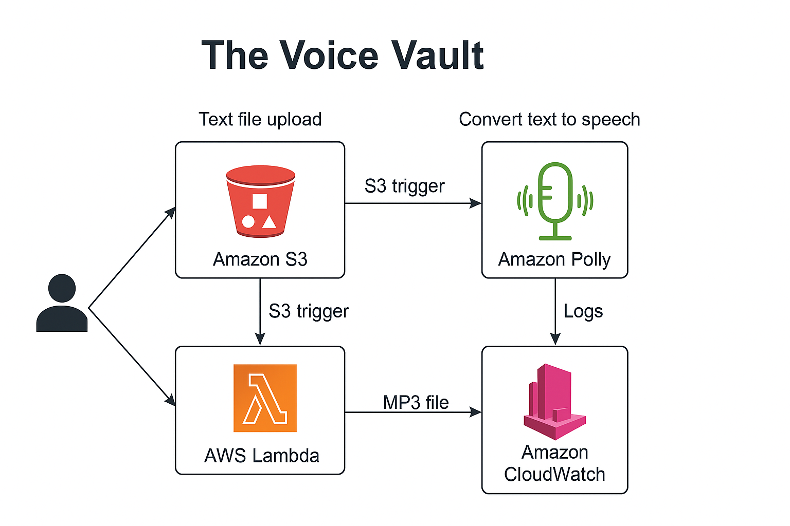
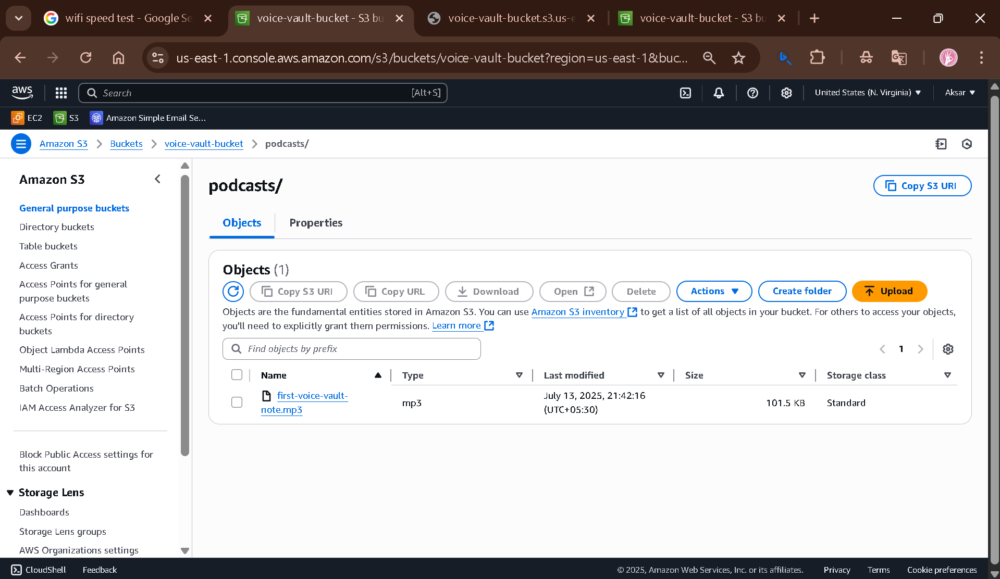

# The Voice Vault 🎙️

> A fully serverless AWS project that converts `.txt` files into lifelike MP3 audio using Amazon Polly.

---

## 🧠 Project Overview

The Voice Vault is a cloud-native solution that turns your text notes into podcast-style audio. Just upload a `.txt` file to Amazon S3, and a Lambda function will process it with Amazon Polly to generate an MP3, which gets stored back in S3. All activities are logged in CloudWatch for visibility and debugging.

---

## 🏗️ Architecture Diagram

Upload `architecture.png` to the root of your project and it will appear here:



---

## 🔁 Workflow

1. User uploads `.txt` file to `/notes/` folder in S3
2. Lambda gets triggered
3. Text is converted to speech by Polly
4. Output MP3 is stored in `/podcasts/` folder in S3
5. Logs of the process are stored in CloudWatch

---

## 📸 Screenshots

### 🟢 1. MP3 File Generated in Audio Folder


---

### 🟢 2. Lambda Execution Logs in CloudWatch


---

## ⚙️ AWS Services Used

- **Amazon S3** – For storing input `.txt` and output `.mp3` files  
- **AWS Lambda** – Processes files automatically on upload  
- **Amazon Polly** – Synthesizes speech from text  
- **Amazon CloudWatch** – Logs Lambda execution details

---

## 📜 Lambda Function Code (Python)

```python
import boto3

def lambda_handler(event, context):
    s3 = boto3.client('s3')
    polly = boto3.client('polly')

    # Extract bucket and key from S3 trigger
    bucket = event['Records'][0]['s3']['bucket']['name']
    key = event['Records'][0]['s3']['object']['key']
    
    # Read text file from S3
    response = s3.get_object(Bucket=bucket, Key=key)
    text = response['Body'].read().decode('utf-8')

    # Convert to speech with Polly
    audio_stream = polly.synthesize_speech(
        Text=text,
        OutputFormat='mp3',
        VoiceId='Joanna'
    )['AudioStream']

    # Save output to /audio/ folder
    output_key = key.replace('notes/', 'audio/').replace('.txt', '.mp3')
    s3.put_object(Bucket=bucket, Key=output_key, Body=audio_stream.read())

    return {
        'statusCode': 200,
        'body': f'MP3 created and saved to {output_key}'
    }
