# 🏗️ Three-Tier WordPress Deployment on AWS

This project showcases the deployment of a **high-availability WordPress website** using the **Three-Tier Architecture** model on AWS. The infrastructure includes a **Load Balancer**, **Auto-Scaling EC2 instances**, **RDS for MySQL**, and **EFS for shared storage**, all managed across public and private subnets.

---
## 📑 Table of Contents

- [Project Overview](#project-overview)
- [Technologies Used](#technologies-used)
- [Architecture Diagram](#architecture-diagram)
- [Phase-wise Implementation Plan](#phase-wise-implementation-plan)
- [Phase 1: VPC and Networking Setup](#phase-1-vpc-and-network-setup)
- [Phase 2: EC2 Instance Deployment](#phase-2-ec2-instance-Deployment)
- [Phase 3: RDS MySQL Setup](#phase-3-rds-mysql-setup)
- [Phase 4: Load Balancer ](#phase-4-load-balancer)
- [Phase 5: EFS Setup (Shared Storage)](#phase-5-efs-setup-shared-storage)
- [Phase 6: Testing the Project](#phase-6-testing-the-project).
- [Challenges I Faced](#challenges-i-faced)
- [What I Learnt](#what-i-learnt)
- [Final Thoughts](#final-thoughts)


---
##  Project Overview

This project demonstrates a complete **Three-Tier Architecture WordPress Deployment on AWS**, built using core AWS services like **VPC, EC2, RDS, EFS, and ALB**. The goal was to create a **highly available, scalable, and secure** infrastructure for hosting WordPress across multiple EC2 instances using shared storage and a central MySQL database.

The three tiers in this architecture are:

- **Web Tier:** Two EC2 instances running WordPress in private subnets behind an Application Load Balancer.
- **App/Data Tier:** A MySQL RDS instance that stores all dynamic WordPress content.
- **Shared Storage Layer:** EFS (Elastic File System) used to share `wp-content` across WordPress instances for media uploads and plugin/theme storage.

We used **public subnets** to host a **bastion EC2 instance**, which allows secure SSH access to the WordPress instances in the private subnets. The **Application Load Balancer (ALB)** is also placed in a public subnet to expose the WordPress application to the internet while forwarding traffic securely to instances in the private layer.

The infrastructure was built **step-by-step from scratch** using the AWS Free Tier wherever possible. Proper security groups, subnet placement, bastion host configuration, and EFS mounting were all implemented manually to ensure deep learning of AWS fundamentals.

---

## 🛠️ Technologies Used

| Category               | Service / Tool           | Purpose                                                                 |
|------------------------|--------------------------|-------------------------------------------------------------------------|
| **Compute**            | Amazon EC2               | Hosts WordPress on Linux-based virtual machines                         |
| **Database**           | Amazon RDS (MySQL)       | Manages WordPress data in a managed MySQL database                      |
| **Storage**            | Amazon EFS               | Provides shared storage between WordPress EC2 instances                 |
| **Networking**         | Amazon VPC               | Custom Virtual Private Cloud to isolate and manage resources            |
|                        | Subnets (Public/Private) | Public for bastion & ALB, Private for application/database layers       |
|                        | Internet Gateway         | Enables internet access for public subnets                              |
|                        | NAT Gateway (optional)   | Would allow private subnets to access the internet (not used here)     |
| **Security**           | Security Groups          | Controls inbound/outbound traffic for EC2, RDS, ALB                     |
|                        | Key Pairs                | Used for SSH access to bastion host                                     |
| **Load Balancing**     | Application Load Balancer| Distributes traffic to WordPress EC2 instances                          |
| **Remote Access**      | Bastion Host (EC2)       | Allows SSH access to private EC2 instances via public subnet            |
| **Web Server**         | Apache HTTP Server       | Serves WordPress content                                                |
| **Scripting**          | Linux Shell              | Commands for installation, setup, EFS mount, and permissions            |
| **WordPress**          | CMS Platform             | Open-source content management system hosted on EC2                     |

---

## 🖼️ Architecture Diagram

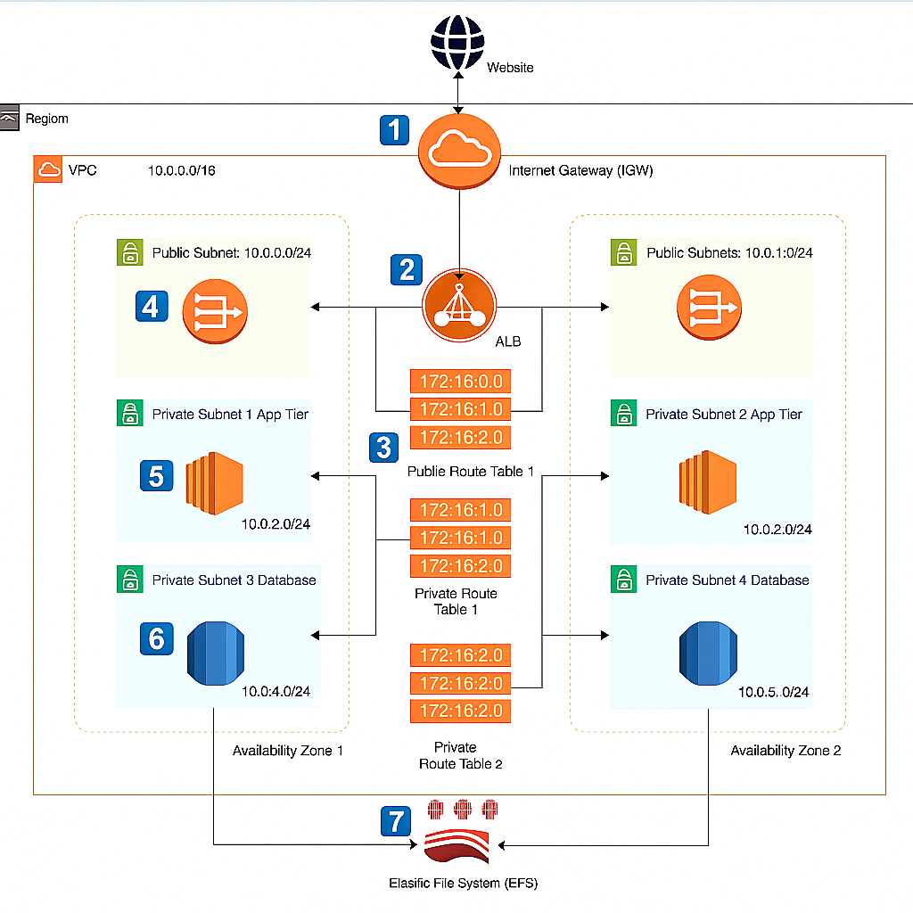

---

<!-- 🔄 How It Works in a Web Request
User opens your WordPress site.

Browser sends HTTP request to the Load Balancer.

Load Balancer forwards it to one of the EC2 instances.

EC2 runs Apache/Nginx + PHP, which loads WordPress code.

WordPress:

Reads PHP code

Pulls dynamic content from MySQL (RDS)

Builds and returns a full HTML page to the user

--- -->

## 📋 Phase-wise Implementation Plan

| Phase | AWS Services Used | Description |
|-------|-------------------|-------------|
| Phase 1 | VPC, Subnets, IGW, Route Tables | Setup network layer for high availability |
| Phase 2 | EC2 (Bastion, App), Security Groups | Configure bastion host and WordPress EC2 instances |
| Phase 3 | RDS (MySQL) | Setup backend database in private subnet |
| Phase 4 | Load Balancer, Target Groups | Enable HA and distribute traffic |
| Phase 5 | EFS | Shared file system between WordPress instances |
| Phase 6 | Testing the Project | Tested WordPress via ALB DNS, verified setup, uploads (EFS), and EC2-RDS connectivity.
 |
| Phase 6 | Cleanup | Remove all resources to avoid billing |


---

## 📌 Phase 1: VPC and Networking Setup

In this phase, we laid the foundation for our secure, isolated network environment using Amazon VPC.

### 🔧 VPC Configuration

- **VPC Name:** `wildpress-vpc`
📸 Screenshot:
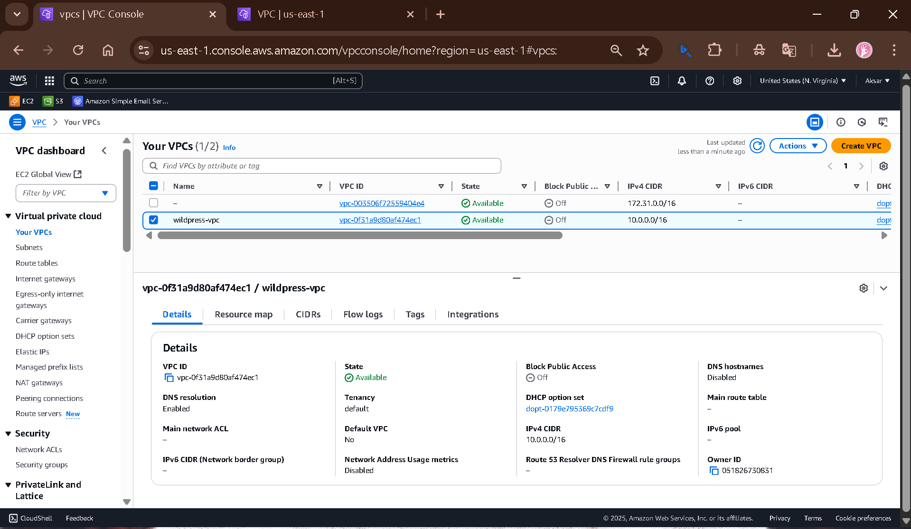
- **CIDR Block:** `10.0.0.0/16`
- **DNS Hostnames:** Enabled


### 🌐 Subnets Created

| Subnet Type | Name                  | Availability Zone | CIDR Block     |
|-------------|-----------------------|-------------------|----------------|
| Public      | public-subnet-a       | us-east-1a        | 10.0.1.0/24    |
| Public      | public-subnet-b       | us-east-1b        | 10.0.2.0/24    |
| Private     | private-app-subnet-a  | us-east-1a        | 10.0.3.0/24    |
| Private     | private-app-subnet-b  | us-east-1b        | 10.0.4.0/24    |
| Private     | private-db-subnet-a   | us-east-1a        | 10.0.5.0/24    |
| Private     | private-db-subnet-b   | us-east-1b        | 10.0.6.0/24    |

📸 Screenshot:
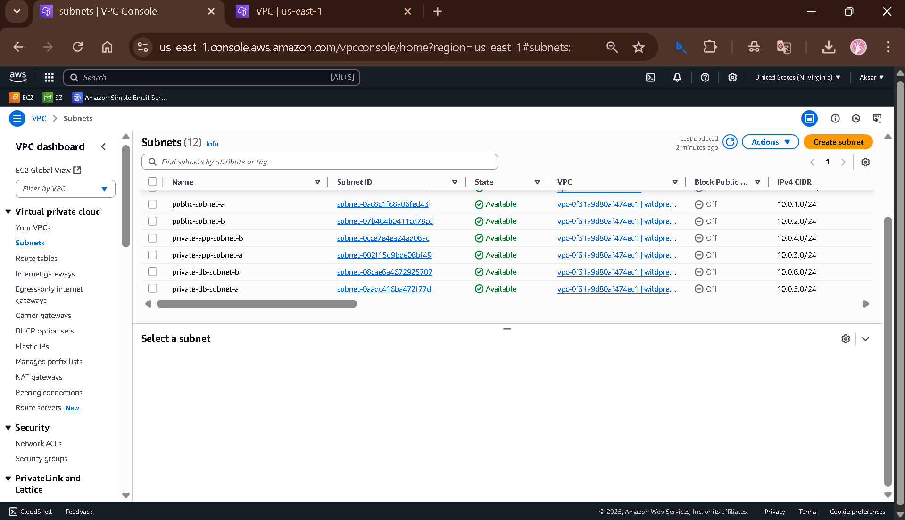

### 🌉 Internet Gateway

- **Name:** `wildpress-igw`
- **Attached to VPC:** `wildpress-vpc`
📸 Screenshot:
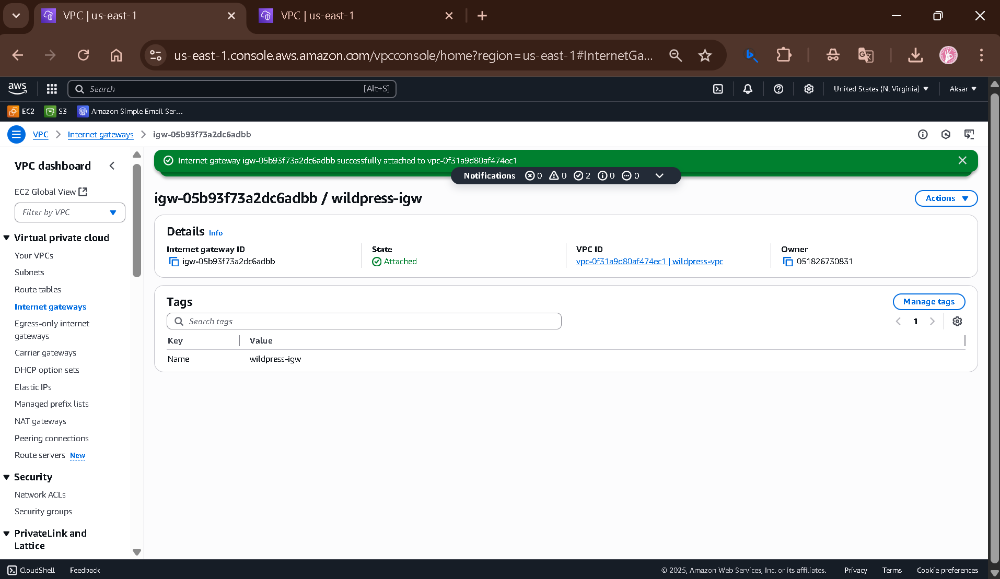

### 📑 Route Tables
- **Route Tables:** Configured for public and private subnets
  
- **Public Route Table**
  - **Name:** `wildpress-public-rt`
  - **Route:** `0.0.0.0/0` → Internet Gateway
  - **Associated Subnets:** `public-subnet-a`, `public-subnet-b`
📸 Screenshot:  
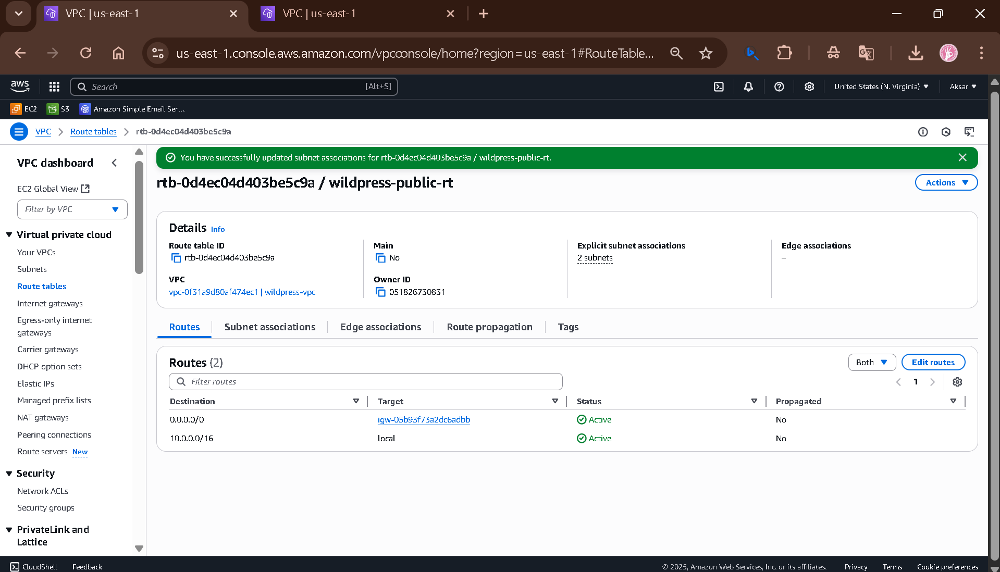

- **Private Route Table**
  - **Name:** `wildpress-private-rt`
  - **Route:** `0.0.0.0/0` → NAT Gateway *(created in Step 5)*
  - **Associated Subnets:** `private-app-subnet-a`, `private-app-subnet-b`
📸 Screenshot:
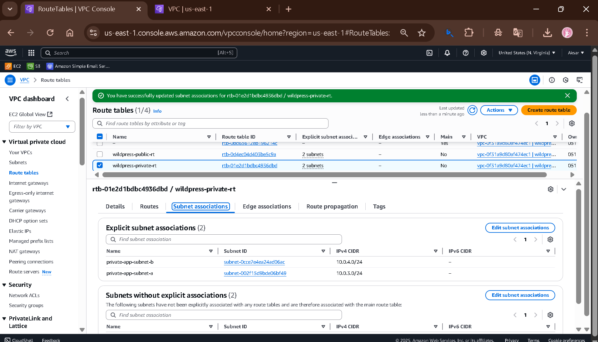

### 🚪 NAT Gateway Setup

- **Elastic IP:** `wildpress-nat-eip`
- **NAT Gateway Name:** `wildpress-nat-gateway`
- **Subnet:** `public-subnet-a`
- **Attached EIP:** `wildpress-nat-eip`
📸 Screenshot:
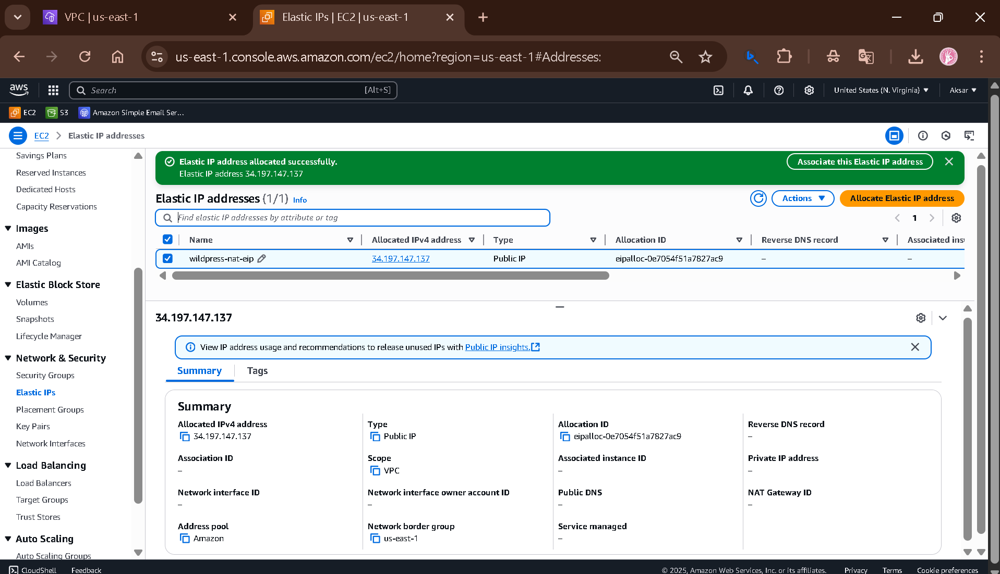

> ✅ **Why Public Subnets & ALB?**
>
> - Public subnets are used to host internet-facing resources like the Application Load Balancer (ALB) and Bastion Host, which require direct access from the internet.
> - The ALB routes incoming traffic to WordPress servers in private subnets, improving both **security** and **scalability**.

---

## 🖥️ Phase 2: EC2 Instance Deployment 

In this phase, we set up the compute layer for our WordPress application:
We launched 3 EC2 instances:
- Deployed two EC2 instances named `wildpress-app-a` and `wildpress-app-b` in private subnets across separate Availability Zones (`us-east-1a` and `us-east-1b`) to ensure high availability.
Configuration:

- **AMI**: Amazon Linux 2  
- **Instance Type**: t2.micro  
- **Key Pair**: `wildpress-key.pem`  
- **Public IP**: Disabled  
- **Security Group**:  
  - Allow SSH from `wildpress-bastion-sg`  
  - Allow HTTP (80) from `wildpress-alb-sg`
📸 Screenshot:


- Launched a Bastion Host (`wildpress-bastion`) in a public subnet to securely access private EC2 instances using SSH.


- Installed and configured Apache, PHP, and WordPress on both instances to serve dynamic web content.
- Configured appropriate Security Groups to allow:
🔐 Security Groups:

- `wildpress-bastion-sg`: SSH from your IP
- `wildpress-app-sg`: HTTP from Load Balancer, SSH from Bastion
- `wildpress-efs-sg`: Access from wildpress App SG

  - SSH access to private EC2s only from the Bastion Host.
  - HTTP access from the Application Load Balancer (ALB).
- Verified that both instances run WordPress and can handle web requests when routed via the load balancer.

---

## 🛢️ Phase 3: RDS MySQL Setup

In this phase, we set up the database layer for persistent storage:

- Launched an Amazon RDS MySQL instance named `wildpress-db`.
- Deployed it in private subnets (`private-db-subnet-a` and `private-db-subnet-b`) within the `wildpress-vpc` to enhance security.
📸 Screenshot:
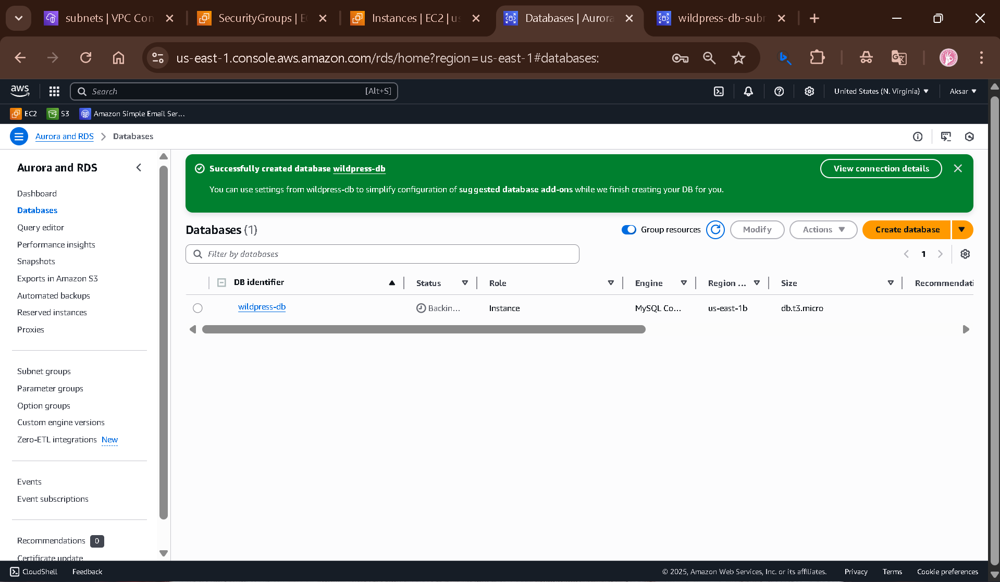
  
- Opted for a single Availability Zone deployment to stay within AWS Free Tier limits (Multi-AZ disabled).
- Created a DB subnet group and associated it with the RDS instance to define eligible private subnets for deployment.
📸 Screenshot:
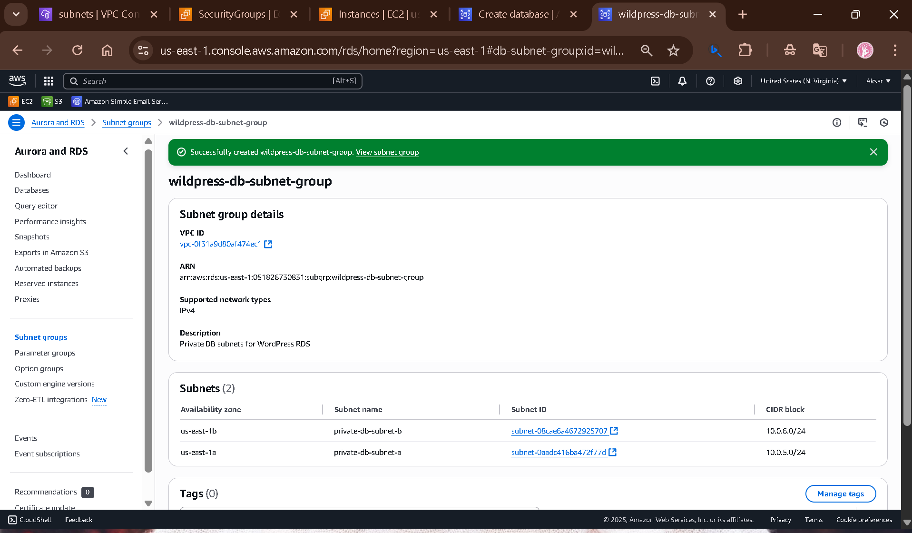
- Configured a security group for the RDS instance to allow inbound MySQL (port 3306) traffic **only** from the EC2 application layer's security group.
- Enabled storage auto-scaling and automatic backups.
- Connected the WordPress application (hosted on EC2) to the RDS database using its private endpoint (internal DNS), ensuring that no public access to the database is allowed.
RDS Access from EC2 (via Bastion)

- **SSH'd into `wildpress-bastion`** (public subnet), then jumped to `wildpress-app-a` or `wildpress-app-b` (private subnet).
   ```bash
   ssh -i wildpress-key.pem ec2-user@10.0.4.221  # example for wildpress-app-b
- **Installed MySQL client** on the EC2 instance to interact with the database.
  ```bash
  sudo dnf install mysql -y
- **Connected to the RDS instance** using its internal endpoint:
  ```bash
  mysql -h wildpress-db.xxxxxxxxxxxx.us-east-1.rds.amazonaws.com -u admin -p
- Created the WordPress database from MySQL prompt:
  ```sql
  CREATE DATABASE wordpress;
- WordPress Configuration for RDS SSH’d into the EC2 app instance (e.g., wildpress-app-a) and edited the wp-config.php file located at /var/www/html/:
  ```php
  define( 'DB_NAME', 'wordpress' );
  define( 'DB_USER', 'admin' );
  define( 'DB_PASSWORD', 'YourStrongPassword123' );
  define( 'DB_HOST', 'wildpress-db.xxxxxxxxxxxx.us-east-1.rds.amazonaws.com' );
- Restarted Apache to apply changes:
  ```bash
   sudo systemctl restart httpd


 
- Verified WordPress database connectivity and successful installation during the setup process.

📸 Screenshot:
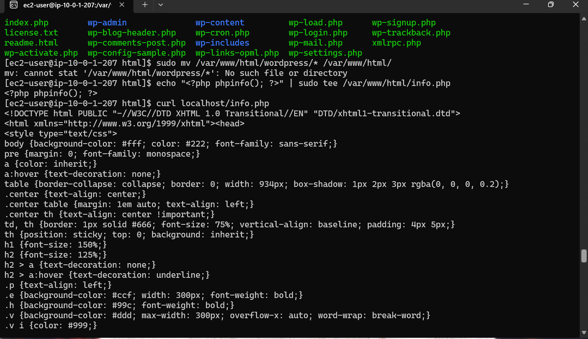

---

## ⚖️ Phase 4: Load Balancer

- Created an **Application Load Balancer (ALB)** named `wildpress-alb`
- Configured in the **public subnets** of VPC `wildpress-vpc` across two Availability Zones (`us-east-1a`, `us-east-1b`)
- Associated a **security group** `wildpress-alb-sg` allowing HTTP (port 80) from anywhere (0.0.0.0/0)
- Created a **Target Group** named `wildpress-tg` with:
  - Protocol: HTTP
  - Port: 80
  - Target Type: Instance
  - Registered both app instances: `wildpress-app-a` and `wildpress-app-b`
  - Enabled health checks on `/` path using HTTP protocol
- Set up a **Listener Rule** on port 80 forwarding all traffic to `wildpress-tg`
📸 Screenshot:
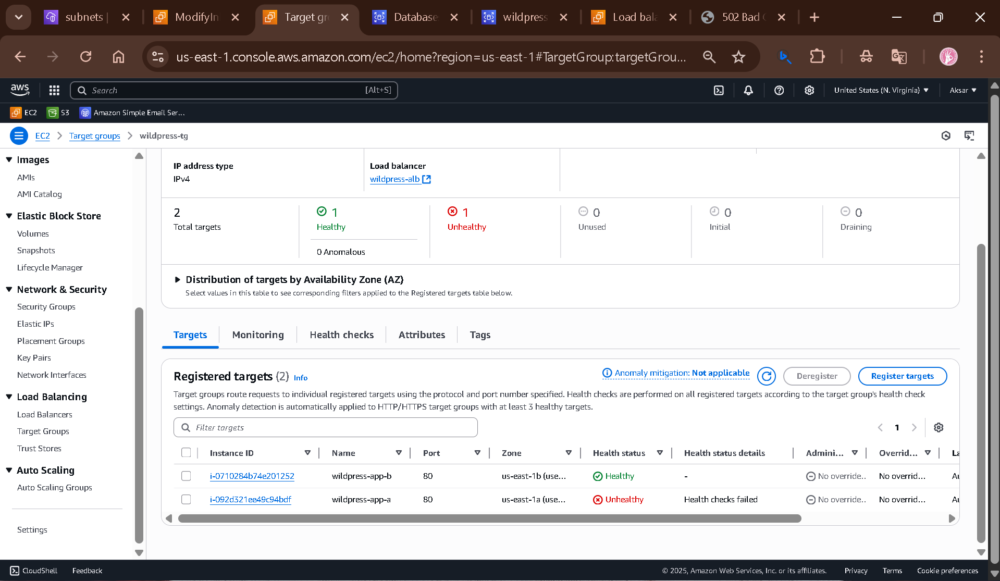

- Verified that the ALB routes requests to healthy targets in round-robin
- Used the ALB **DNS name** (e.g., `wildpress-alb-123456789.us-east-1.elb.amazonaws.com`) to access the WordPress site in browser

📝 **Purpose**:  
The ALB evenly distributes incoming web traffic across multiple EC2 app instances. It ensures **high availability** and **fault tolerance**. Placing it in public subnets allows internet-facing traffic to reach the private EC2 app layer securely through ALB.

📸 Screenshot:
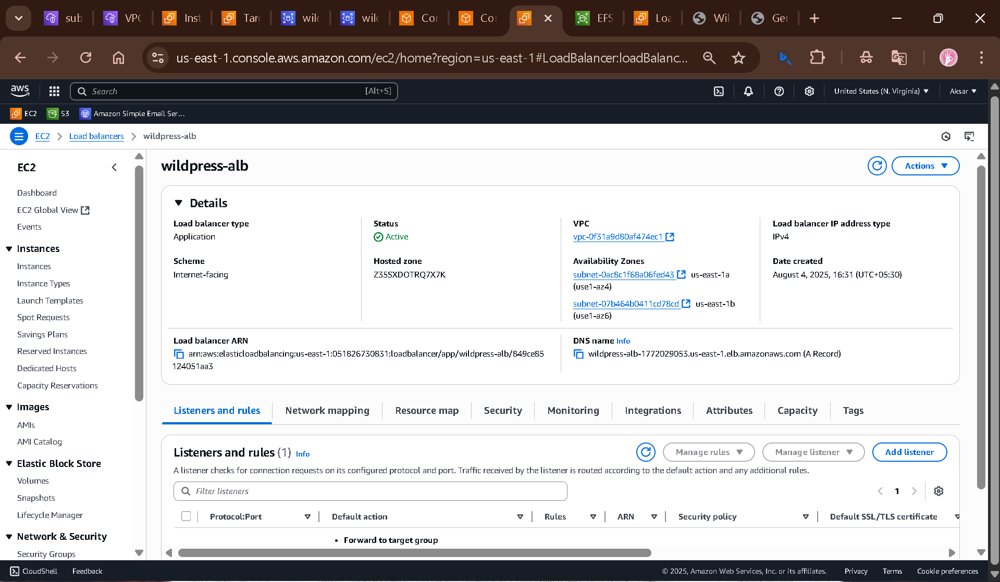

---

## 📂 Phase 5: EFS Setup (Shared Storage)

- Created an **Elastic File System (EFS)** named `wildpress-efs`
- Deployed inside the **same VPC** (`wildpress-vpc`) with mount targets in both private subnets (`us-east-1a` and `us-east-1b`)
📸 Screenshot:
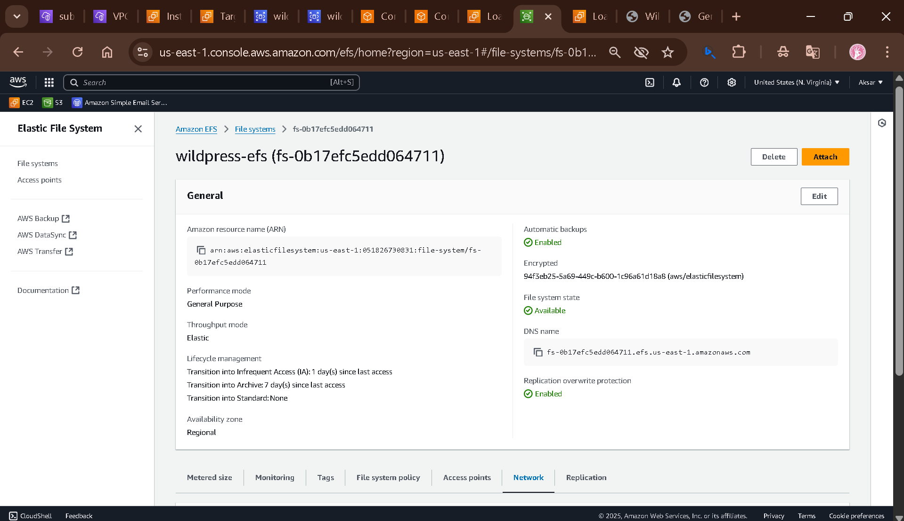
  
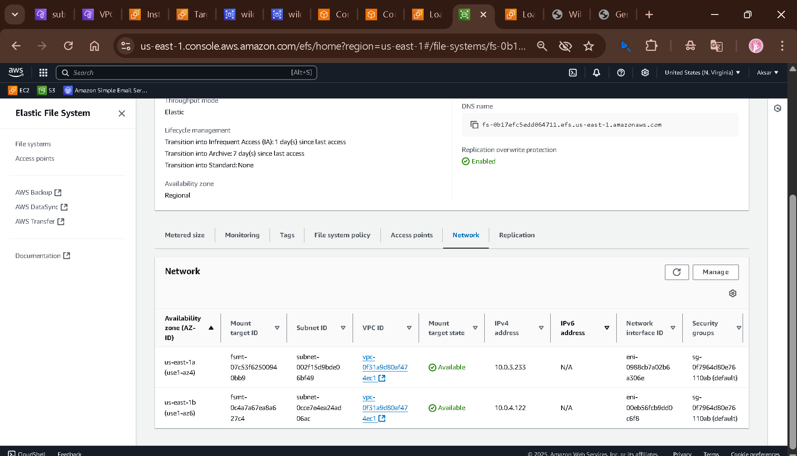

- Associated EFS with a **security group** `wildpress-efs-sg` allowing NFS traffic (port 2049) from the app instances' security group (`wildpress-app-sg`)
- Installed the EFS mount helper on both EC2 app instances:

  ```bash
  sudo yum install -y amazon-efs-utils
📸 Screenshot:


- Created a shared mount point directory on both app instances:
  ```bash
  sudo mkdir /var/www/html/wp-content/uploads
- Mounted EFS on both instances:
  ```bash
  sudo mount -t efs -o tls <EFS-FILE-SYSTEM-ID>:/ /var/www/html/wp-content/uploads
- Verified that files uploaded through one app instance (e.g., via WordPress media library, creting a text file on one instance and look the file in other instance ) are visible on the other instance
📸 Screenshot:
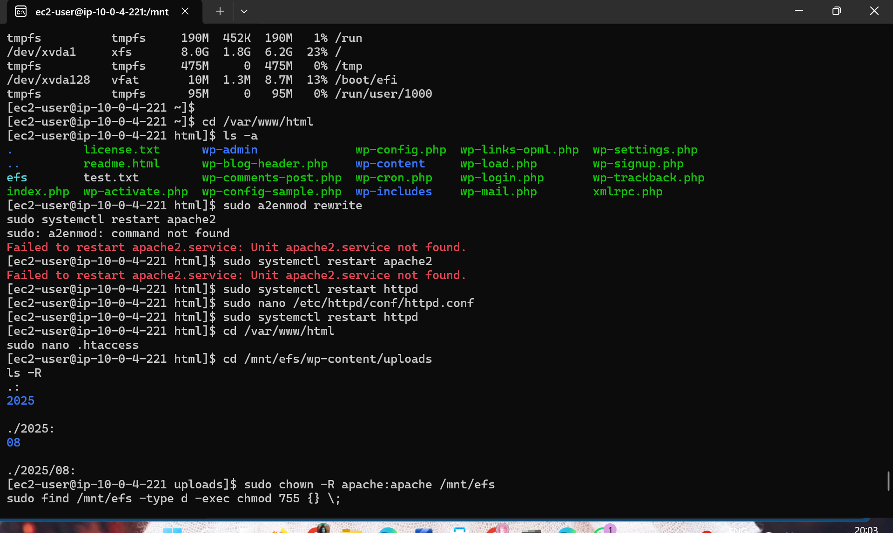

📝 Purpose:
EFS provides shared storage between the two app servers. This is essential for WordPress media uploads, ensuring consistency across both EC2 instances behind the load balancer. 

---

## ✅ Phase 6: Testing the Project

- After setting up the **Application Load Balancer**, we copied its **DNS name** (e.g., `wildpress-alb-1234567890.us-east-1.elb.amazonaws.com`)
- Pasted the DNS into a web browser to test the live application

### 🔍 What We Verified:

- The WordPress **setup screen** loaded successfully from the ALB DNS  
- Created a **WordPress site** with:
  - Site Title
  - Admin Username & Password
  - Admin Email
- Logged into the **WordPress dashboard**
📸 Screenshot:
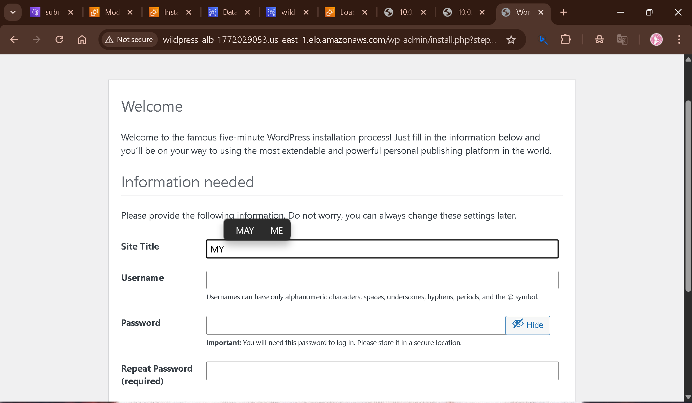

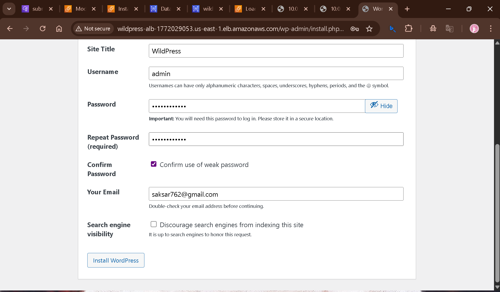

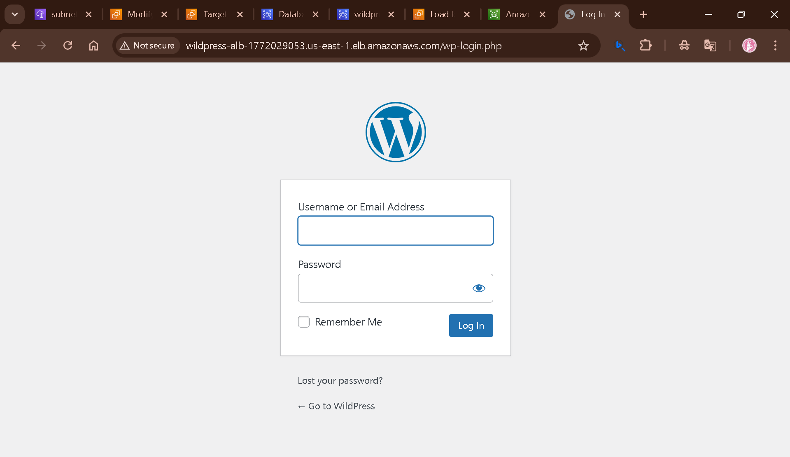

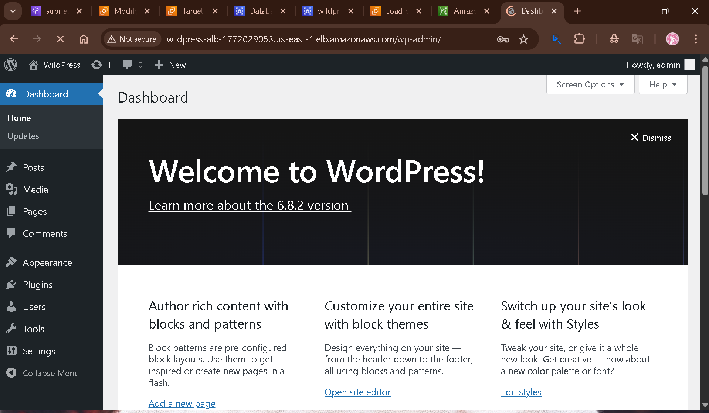

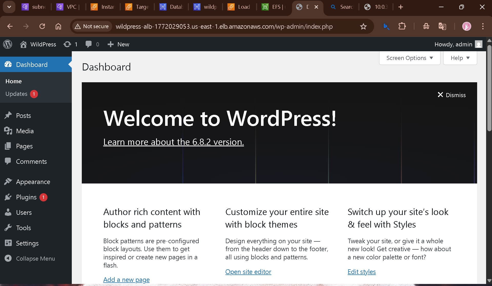


- Uploaded a media file via WordPress → Confirmed it was:
  - Saved in the EFS (shared between app instances)
  - Visible from both app instances (verifying EFS mount was successful)
- Ensured proper **load balancing** by refreshing the page multiple times
- Verified **database connection** to RDS was working by confirming post/page storage
- New Home Page
📸 Screenshot:
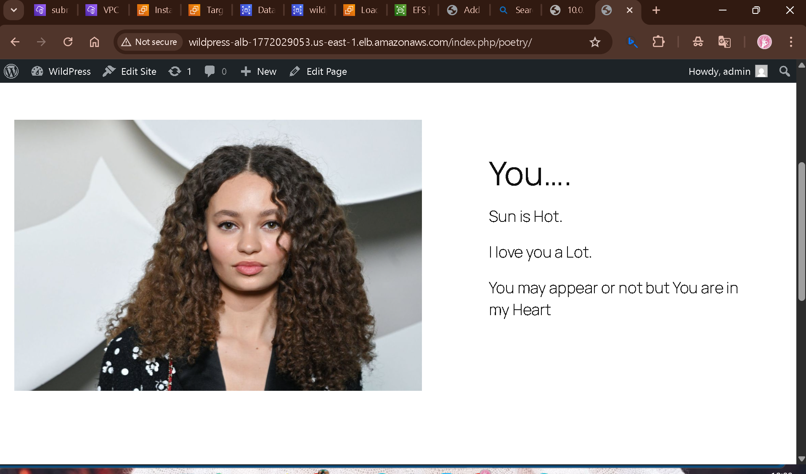

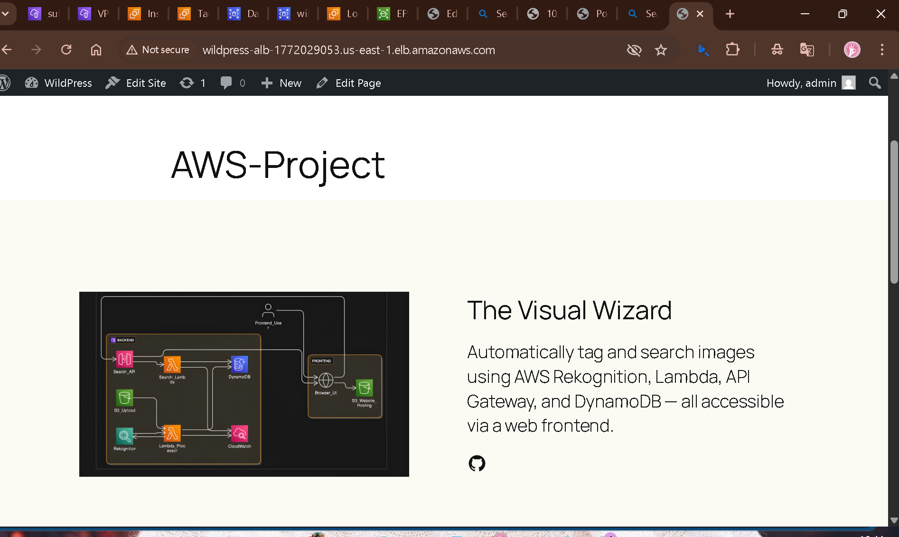

🧪 **Final Check**:  
Our WordPress site is now accessible globally via the ALB DNS. The setup supports:
- High availability
- Shared file system (EFS)
- Centralized database (RDS)
- Auto-scalable app tier (EC2 behind ALB)
  
---

## 🚧 Challenges I Faced

- **EC2 Access via Bastion**: Initially misconfigured security groups, which blocked SSH access to private EC2 instances.  
  ✅ *Solved by allowing inbound SSH only from the bastion’s private IP in the security group.*

- **Database Connectivity Issues**: Could not connect EC2 to RDS due to subnet or DNS resolution problems.  
  ✅ *Solved by ensuring RDS was in private subnets, enabling DNS hostnames, and using the correct RDS endpoint in `wp-config.php`.*

- **Incorrect RDS Configuration in WordPress**: Mistyped the DB credentials and endpoint.  
  ✅ *Fixed by editing the `wp-config.php` file and providing the correct DB name, user, password, and RDS endpoint.*

- **Unhealthy Targets in ALB**: Target instances in the load balancer showed as unhealthy.  
  ✅ *Resolved by fixing the health check path to `/index.php`, making sure Apache and WordPress were properly running.*

- **EFS Not Mounting**: EFS didn't mount on EC2 because of missing NFS tools.  
  ✅ *Installed `nfs-utils` and used correct mount commands along with valid security group rules.*

- **WordPress Setup Loop**: After ALB was configured, WordPress setup ran again on each EC2 instance.  
  ✅ *Fixed by setting up shared storage with EFS to keep a consistent `wp-content` directory across instances.*

---

## 📘 What I Learnt

- How to design and deploy a **highly available three-tier architecture** using AWS services.
- The importance of **public vs. private subnets**, and how to secure infrastructure using VPC and security groups.
- How to **launch and configure EC2 instances**, and manage SSH access using a bastion host.
- Setting up a **MySQL RDS instance** and securely connecting it to backend instances.
- Configuring **WordPress to work with external RDS** instead of local MySQL.
- Using **Application Load Balancer (ALB)** to distribute traffic across multiple EC2 instances.
- Mounting and sharing files using **Elastic File System (EFS)** between app instances for persistent storage.
- Troubleshooting issues related to connectivity, configuration, and health checks.
- Overall, how to **combine multiple AWS services** to build a scalable, secure, and highly available WordPress web application.


---

## ✅ Final Thoughts

This project helped me understand the real-world implementation of a scalable and secure web application using AWS. By building each layer step-by-step — from networking to storage and application deployment using a production-style three-tier architecture on AWS. Each component — EC2, RDS, ALB, EFS — played a crucial role in building a reliable, distributed system. From security best practices to testing DNS endpoints, — I gained practical experience that goes beyond basic tutorials. The combination of theory and hands-on work helped solidify my understanding of AWS architecture and services.


